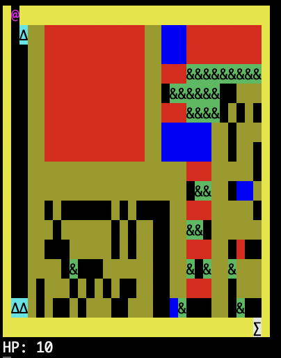

# Game Description

## Introduction
This project is about the development of a roguelike game using F#. The report details the coding process and the methodologies used in structuring the code. It provides an explanation of the functions and how the code operates.

## Run game

#### Compile Library
fsharpc --doc:dok.xml -a roguelike.fs
#### Compile level
fsharpc -r roguelike.dll roguelike-game.fsx
#### Run level
mono roguelike-game.exe
#### Controls:
Move up: Arrow up
Move down: Arrow down
Move left: Arrow left
Move right: Arrow right
Restart game: r
Jump over solid: <interact with object> w
Stop game: ctrl c

## Program Description
The game consists of several elements:

### Player
The `Player` type includes members (functions) that define what the player can do, like getting coordinates, registering damage, updating hitpoints (life in integers), etc. The `Player` class has specific hitpoints, and members that handle movement, registering damage, and determining the game state (win or lose).

### Items
The player can interact with various objects, which are entities in a `World`. The interaction affects the player's status, hitpoints, and position. Some objects in the game are:

- **Wall**: Solid, cannot be passed through, does not interact with the player.
- **Water**: Heals the player by 2 hitpoints each time, up to 20 hitpoints, and can be passed through.
- **Fire**: Damages the player up to 5 times. Can be passed through, but applies a debuff that damages 1 hitpoint per turn for 5 turns. This effect is removed upon contact with water.
- **FleshEatingPlant**: Damages the player by 5 hitpoints upon interaction, cannot be passed through.
- **Exit**: The win-condition of the game. The player needs at least 5 hitpoints to win by interacting with the exit. If the player does not have 5 or more hitpoints, they can pass through the exit without winning.

### World
The `World` type is used to add all the entities (items, player) to the game. It has a `Play` function that enables the `Player` to interact with the rest of the `World`.

## Expansions
The game includes three expansions:

- **Random teleportation**: An object that teleports the player to a random location when interacted with, avoiding solid objects.
- **Jumping**: A function that allows the player to jump over solid objects, but only one object at a time.
- **OnFire**: A modification to the `Fire` object that applies a debuff to the player, causing 1 hitpoint of damage per turn for 5 turns. This effect is removed upon contact with water.

## Results and Discussion
Generally, the game functions as desired, although there are visual inconsistencies when an object, such as fire, is removed from the canvas. It stops functioning but remains visually present. For those looking for a challenge, our record time to beat the game is 5.54 seconds.
